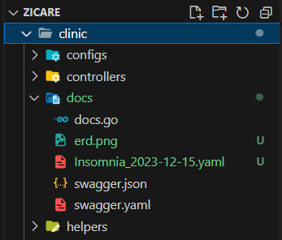
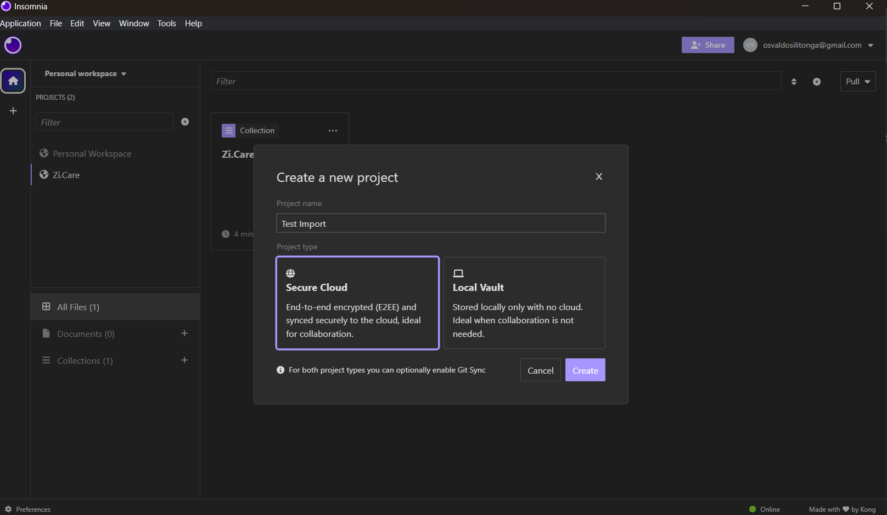
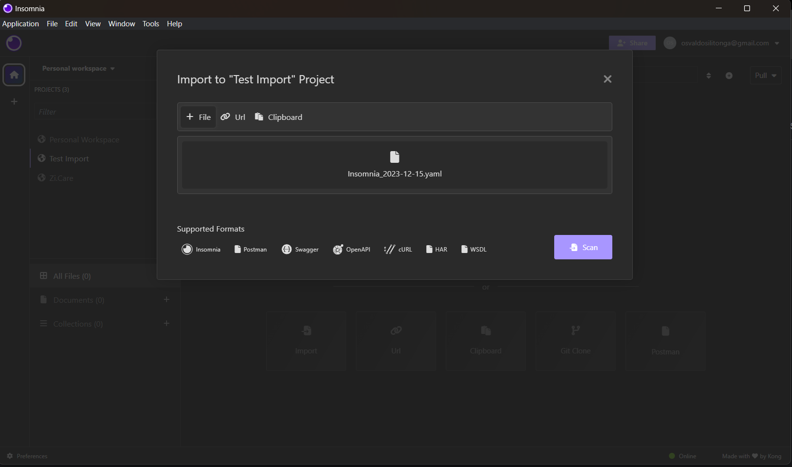
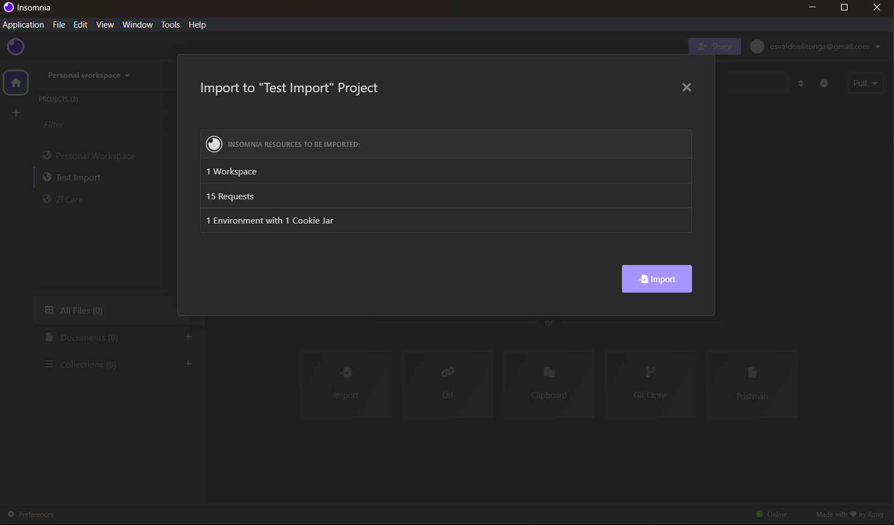
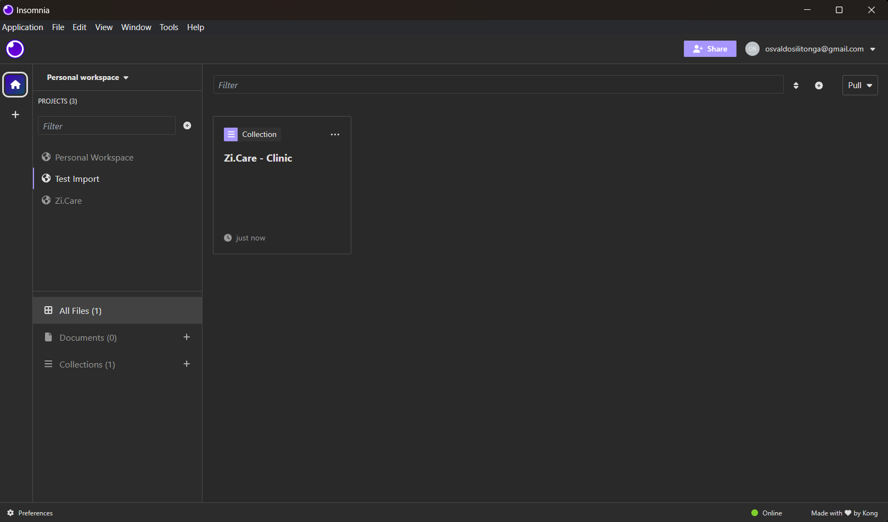
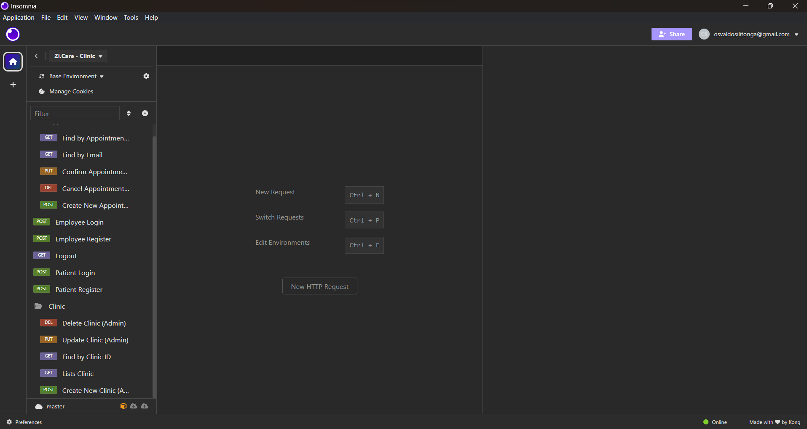

# Clinic Reservation

**NOTE :** Algorithm folder contains a logic to find a number sequence inside an array of numbers. To run the test file, go to alogrithm folder and run:

```bash
 $ go test
```

## Description

Swagger Documentation - [localhost:8080/swagger/index.html](http://localhost:8080/swagger/index.html)

### Background

The Clinic Consultation Scheduling System is an application designed to streamline the process of scheduling consultations at a clinic efficiently. This application provides users with the ability to:

- **Schedule Appointments:** Patients can easily choose a convenient time for consultation, and the system will generate a queue number automatically.
- **Identity Verification:** The system ensures security by verifying the patient's identity, ensuring the confidentiality of medical information.
- **Ability to Cancel Appointments:** Users have the option to cancel their scheduled appointments through the application, providing flexibility in managing their schedules.

## Database Schema - ERD

The System utilizes PostgreSQL as its underlying database management system. PostgreSQL is a powerful, open-source relational database that provides robust support for handling complex data structures and ensuring data integrity.


## Stucture

The project is organized following a clear directory structure and implement repository pattern for easy navigation and understanding. Below is an overview of the main directories and their respective purposes:

### Directory Structure

- **`/clinic`:** This directory contains the source code of the Clinic Consultation Scheduling System.

  - **`/router`:** The router folder houses the routing configuration for the API. Here, you'll find files defining the routes, middleware, and any additional routing-related components.

  - **`/controllers`:** Management of the REST interface to the business logic.

  - **`/services`:** Business Logic implementation.

  - **`/repositories`:** Responsible for any kind of data fetching or data posting activity. This can be interactions with databases or external API.

  - **`/models`:** This directory includes the data models for the application. Here, you'll find models for patient, employee, appointments, and any other relevant entities.

  - **`/routes`:** The routes directory manages the endpoint definitions for the API. Each route corresponds to specific actions.

  - **`/config`:** Configuration files for the application, including database configuration and other parameters.

  - **`/helpers`:** The helpers folder contains utility functions and helper modules used throughout the application. This includes commonly used functions that assist in various tasks, enhancing code maintainability and readability.

  - **`/utils`:** The utils folder consists of general-purpose utility functions and modules.

  - **`/migration`:** The migration folder contains database migration scripts. These scripts manage changes to the database schema over time, ensuring that the database structure aligns with the application's evolving requirements.

  - **`/docs`:** Documentation for the project. This directory may include API documentation, user guides, and additional resources for developers.

## How to Use

Via Git Clone :

- Clone Repo

  ```bash
  git clone https://github.com/osvaldosilitonga/Clinic-Reservation.git
  ```

- Configure .env file

  ```shell
  SERVER_PORT=

  # Development
  DB_PG_STRING=

  # Production
  # DB_PG_STRING=

  MIGRATION_URL="file://migrations"

  JWT_SECRET=
  ```

- Run App

  ```bash
  $ go run .
  ```

<br />

Via Docker Compose :

- Configure .env file

  ```shell
  SERVER_PORT=

  # Development
  DB_PG_STRING=

  # Production
  # DB_PG_STRING=

  MIGRATION_URL="file://migrations"

  JWT_SECRET=
  ```

- Run Docker Compose

  ```
  $ docker compose up
  ```

<br />

Via Compressed File :

- Extract file
- Run Docker Compose

  ```
  $ docker compose up
  ```

## Insomnia API Client

- Make sure you have Insomnia installed.

- Insomnia YAML file location

  

- Create new project

  

- Upload insomnia YAML file

  

- Import file

  

  

- Happy Testing

  
